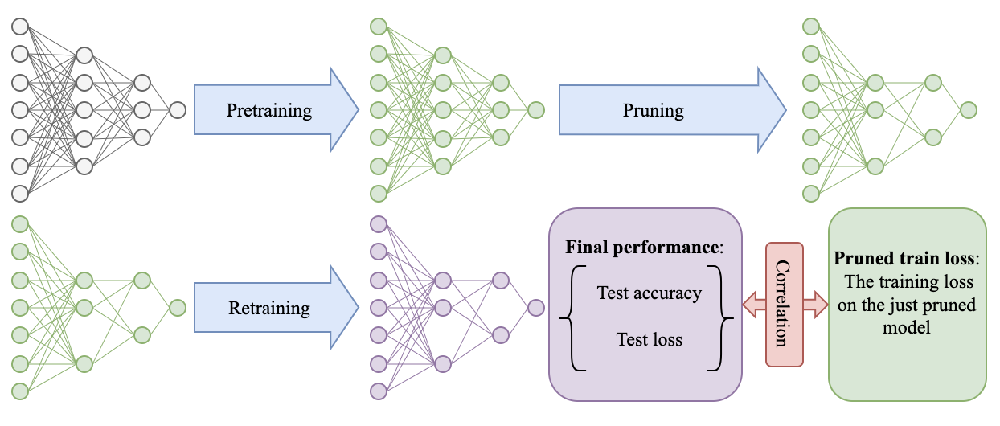
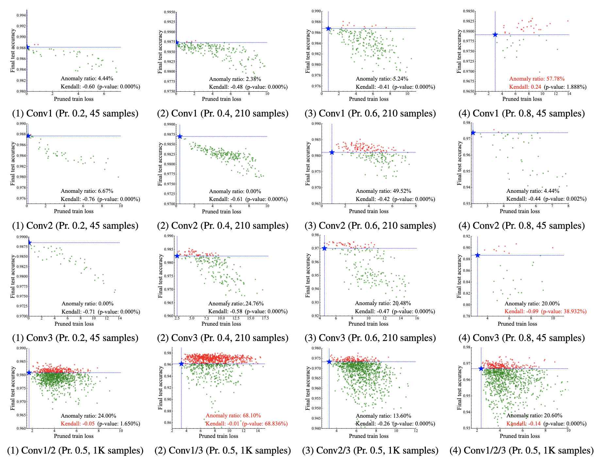

<div align="center">
  <h2><b> Is Oracle Pruning the True Oracle? </b></h2>
</div>

<div align="center">


</div>

<div align="center">

**[<a href="">Paper Page</a>]**

</div>

<div align="center">


</div>

This repository is for our paper:

> **[Is Oracle Pruning the True Oracle?](https://github.com/fscdc/Oracle-Pruning-Sanity-Check)** \
> [Sicheng Feng](https://fscdc.github.io/)<sup>1,2</sup>, [Keda Tao]()<sup>1,3</sup>, [Huan Wang](http://huanwang.tech/)<sup>1,*</sup> \
> <sup>1</sup>School of Engineering, Westlake University, Hangzhou, China \
> <sup>2</sup>College of Computer Science, Nankai University, Tianjin, China \
> <sup>3</sup>School of Communication Engineering, Xidian University \
> <sup>∗</sup>Corresponding author: wanghuan@westlake.edu.cn


---
>
> 🙋 Please let us know if you find out a mistake or have any suggestions!
> 
> 🌟 If you find this resource helpful, please consider to star this repository and cite our research:

```
TODO
```

## Updates/News:

🚩 **News** (Nov. 2024): First release!

## Introduction
*Oracle pruning*, which selects unimportant weights by minimizing the pruned train loss, has been taken as the foundation for most neural network pruning methods for over 35 years, while few (if not none) have thought about how much the foundation really holds. This paper, for the first time, attempts to examine its validity on modern deep models through empirical correlation analyses and provide reflections on the field of neural network pruning. Specifically, for a typical pruning algorithm with three stages (pertaining, pruning, and retraining), we analyze the model performance correlation before and after retraining. Extensive experiments (**37K** models are trained) across a wide spectrum of models (LeNet5, VGG, ResNets, ViT, MLLM) and datasets (MNIST and its variants, CIFAR10/CIFAR100, ImageNet-1K, MLLM data) are conducted. The results lead to a surprising conclusion: on modern deep learning models, the performance before retraining is barely correlated with the performance after retraining. Namely, the weights selected by oracle pruning can hardly guarantee a good performance after retraining. This further implies that existing works using oracle pruning to derive pruning criteria may be groundless from the beginning. Further studies suggest the rising task complexity is one factor that makes oracle pruning invalid nowadays. Finally, given the evidence, we argue that the retraining stage in a pruning algorithm should be accounted for when developing any pruning criterion.

<p align="center">

</p>

- Analysis framework of this work. We study the validity of oracle pruning in this paper, by examining the correlation between the *pruned train loss* and the *final test performance* (test accuracy or test loss). We apply this analysis framework to a wide range of networks and datasets (from toy networks like LeNet5-Mini to very large ones like ViT-B/16 and TinyLLaVA-3.1B) in order to have a comprehensive evaluation. The key finding of this work is that on modern networks and datasets (starting from the CIFAR level), oracle pruning is invalid, to our surprise. This new finding acutely challenges the conventional belief in network pruning over the past 35 years.


<p align="center">

</p>


## Requirements and Installation

We use Python 3.10 from Anaconda. Two conda environments are provided for the experiments: `./pruning/environment.yml` and `./pruning-transformer/environment.yml`. The second one is for ViT experiments, while the first one is for other experiments.

To install all dependencies:
```
conda env create -f ./pruning/environment.yaml

# or
conda env create -f ./pruning-transformer/environment.yaml
```

## Datasets
All datasets used in the experiments, except for ImageNet, can be automatically downloaded via the code. This includes MNIST and its variants, CIFAR10, and CIFAR100. For ImageNet, please download it from this link (https://www.image-net.org/).


## How to Reproduce Experiments 


The pipeline to reproduce the experiments in the paper is as follows:


1. Get ready for the two conda environments and ImageNet dataset.


2. Place the pretrained models (from release: **Reproduce-Necessities**) in the `./pruning/Experiments/` directory. 


3. Place the combination files (from release: **Reproduce-Necessities**) in the `./pruning/Combinations/` directory (maybe need to change name according to the experiment. If you have problems, feel free to *pull request*). 


4. Run the following command to reproduce the experiments in the paper. The command is in the format of `./xx.sh`. There is two code bases: `pruning` and `pruning-transformer`. The former is for the experiments on LeNet5, VGG19, and ResNets, while the latter is for the experiments on ViT.


(1) **ViT** experiments: If you want to modify used gpus, please modify the `gpu_ids` and `num_processes` in the `./pruning-transformer/default_config.yaml` file. (Default: `gpu_ids: 0,1,2,3` and `num_processes: 4`)


```bash
cd pruning-transformer
./scripts/vit_imagenet_torch.sh
```

(2) **LeNet5** experiments: 

```bash
cd pruning
./scripts/pruning-lenet5-xxx.sh
```

(3) **VGG19** experiments: 

```bash
cd pruning
./DEV_sicheng/scripts_pruning/pruning-vgg19-lr2.sh
```

(4) **ResNet56** experiments: 

```bash
cd pruning
./DEV_sicheng/scripts_pruning/pruning-resnet56-lr2.sh
```

(5) **ResNet18** experiments: 

```bash
cd pruning
./DEV_sicheng/scripts_pruning/pruning-resnet18-lr2.sh
```

## Further Reading

1, [**What is the State of Neural Network Pruning?**](https://arxiv.org/abs/2003.03033), in *MLSys* 2020.
[\[GitHub Repo\]](https://github.com/jjgo/shrinkbench)

```bibtex
@inproceedings{blalock2020state,
  title={What is the state of neural network pruning?},
  author={Blalock, Davis and Gonzalez Ortiz, Jose Javier and Frankle, Jonathan and Guttag, John},
  booktitle={MLSys},
  year={2020}
}
```

## Acknowledgement
Our implementation adapts [TPP](https://github.com/MingSun-Tse/TPP) and [Torch-Pruning](https://github.com/VainF/Torch-Pruning) as the code base and have extensively modified it to our purposes. We thank the authors for sharing their implementations and related resources.